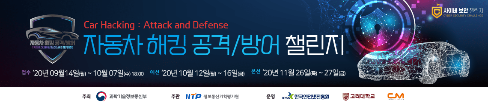

  

### 10월 6일 자동차 AI해킹 공격/방어팀 팀구성 완료!!  

### 10월 8일 1차 멘토링  

### 10월 15일 1차 제출 10등(본선은 8등까지)  

### 10월 16일 예선 종료 (후기 & 팁's)
- 이..글을.....보시는..분...들께...(다잉메시지...윽) 
  - 50점대 팀들을 제외하고 대회를 거의 꼴등으로 마무리하였습니다.
  - 이번 대회에서 얻은, 공유하고싶은, 세 가지 교훈이 있습니다.
  - 내년도 자동차 해킹 공격/방어 대회를 준비하시는 분들께 도움이 되셨으면 합니다.
  - 대회준비하면서 실력이 정말 많이 늘었습니다. 내년 자동차 해킹 대회에 꼭 지원해보시길!
  - 트래픽 머신러닝을 전혀 모르시는 분들을 위해 베이스라인 코드도 대회가 마무리 되는 날 공유할 예정입니다!
  - __F1 스코어에 속지 말자!__
    - `F1 스코어가 99라면 모델이 데이터셋에 과적합 되었을 가능성이 농후합니다`
  - __트래픽 탐지 문제는 Recall에 집중하자!__
    - `실제로 F1 99 / Recall 90 일때 대회점수보다 F1 90 / Recall 99 일때 점수가 더 높게 나왔습니다`
  - __데이터 전처리 & 피쳐 추출이 우선, 머신러닝은 나중!__
    - `데이터 분류가 잘못되었다면, 머신러닝 하이퍼파라미터 수정만으론 점수 상승이 불가능 합니다ㅠㅠ`
