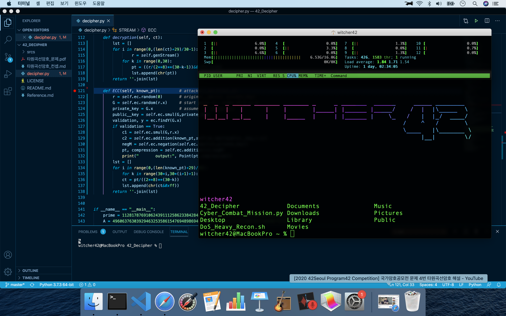

>*“실패를 한다는 것, 시행착오가 온다는 것은 굉장히 인생에 도움이 되는 것.”*  
>>**YTN [LIVE] 태양 절반이 가려진다…'우주쇼' 부분일식**  
>>20.6.21 충주고구려천문과학관 별박사 이태형  
  
  
  
__커리큘럼__  
2020. 7월 ~ 2020. 11월 (5개월)  
▲정보보호 ▲데이터 분석 ▲AI 기초 등의 이론 교육(48시간)  
▲악성코드 자동분류 ▲취약점 자동탐지 ▲빅데이터 분석 등의 실습 교육(72시간)  
▲수리·통계·데이터 과학 등의 특강(32시간)  
▲AI보안 실습에 특화된 워크숍 형태의 부트캠프(2박 3일)  
▲산업계 멘토와 함께하는 팀프로젝트  
  
http://www.kisaaisec.or.kr/  
# 수업자료/수업내용 보다는 공부한 것들을 올리는 레포입니다!  

  
