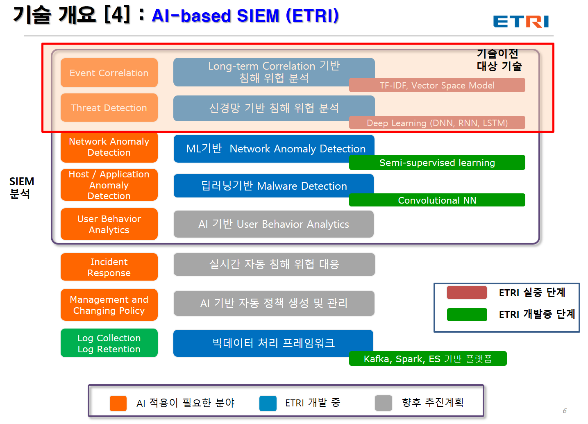

# 지능형 SIEM을 위한 인공신경망기반 데이터 분석 및 탐지 기술
📚📕📖  
이종훈 ‖ ETRI 지능보안연구그룹  
  
- 기존 SIEM 솔루션이나 SOC 센터에서 사이버 침해 위협 탐지 및 분석을 위해 수집된 보안 이벤트에 대해 룰 및 정책을 기반으로 분석함  
  - 보안장비에서 발생하는 대량의 이벤트로 인해 데이터 분석의 어려움이 있음    
  - 빅데이터 로그기반으로 보안 위협을 탐지하기 위한 많은 시간과 인력이 소요됨    
  - 보안 이벤트와 로그를 운영자가 수동적으로 분석하여 탐지하는데 한계가 있음   
- 머신러닝을 통한 학습과 AI 기술을 이용한 침해위협 탐지가 필요  

- 단위 시간(1분 – 4분) 별로 발생한 IPS 이벤트 동시발생 패턴을 TF-IDF 알고리즘을 통하여 벡터화함  
- 이벤트 동시 발생 패턴과 정탐이 있었던 경우의 네트워크 IP 정보를 데이터 프로파일링 하여, 학습데이터내에서 연관도가 높은 프로파일을 추출(Vector Space Model)  
- 연관된 프로파일의 정상, 공격 분포(Nearest Neighbor Alg.), 통계정보 및 베이스라인 프로파일과의 연관도를 생성하여 딥러닝을 통한 학습 및 탐지추론 수행  

- 본 기술은 룰 없이 데이터 마이닝을 기반으로 과거 Long-term 데이터 분석하고 학습하여 자동적으로 침해 위협을 인지하기 위한 분석 기술임 
- 다양한 보안이벤트에 대한 
  - 데이터 전처리  
  - 연관성을 분석을 통한 사전 학습  
  - 딥러닝 지도학습  
  - 모델 생성  
  - 공격 징후 판단  
- SIEM 기반 딥러닝 및 머신 러닝을 통한 보안 관제 이벤트 정오탐 자동화 및 침해 위협 탐지를 위한 분야에 활용 가능  
- SIEM을 위한 AI 시스템은 대규모 보안관제 센터를 대상으로 구축 및 적용을 하고 있으나, 소규모 네트워크를 위한 보안 관제 및 Small 플랫폼형의 AI 보안관제 구축을 위한 솔루션으로 적용 가능  

  

