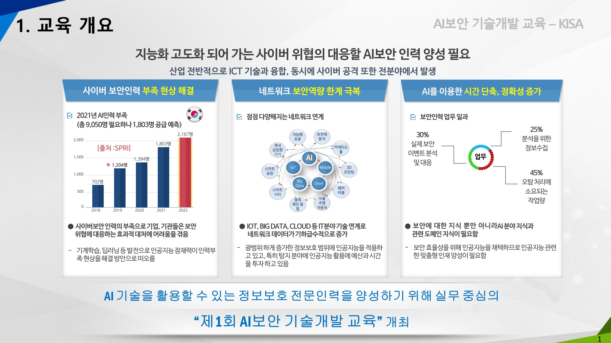

__지원계기__  
42 Piscine 후에 보안쪽으로 진로를 결정하고 이곳저곳에 무료 단기강의들을 들으러 다녔는데,  
~~생각보다 (보안일을 그만두신) 강사분들의 수준이 높지 않아서 당황했습니다.~~  
~~안랩 A-FIRST 출신이 __라이브데이터__ 에 숨겨진 드롭퍼를 못찾는 것을 보면서 흠~~  
(고급과정 입과 역량테스트를 진행하면서 제가 잘하는건 단지 기술적인 부분이고,
이론적인 부분은 전반적으로 많이 부족하다는 것을 깨달았습니다  
강사님은 관리자 급이니 일부 기술적인 측면은 부족할수도 있다는 생각(산업기사와 기사의 차이?!)  
교만한자 필패할 것이다 크흡...)  
아마도  
보안쪽은 프로그래밍 실력 외에  
멘탈3요소-__집중력,체력,센스__-도 포함되기때문에   
나이가 중요한 요소로 작용하지 않나 생각하게 되었습니다.    
흥미도가 떨어진 40대라면 다소 불리한 직업군, 생명주기가 매우짧은 직업군이라 생각하였고,  
따라서 롱런·롱샷을 꿈꾸는 저에게는 __AI 보안 교육__ 이 절실했습니다!!  
  
__필기__  
필기는 보안30문제, 인공지능20문제 이렇게 나왔는데  
보안문제는 아는걸 틀리고  
인공지능쪽은 공부한게 거의 안나왔습니다.  
간단한 분포계산, 분포도, 확률 통계 이렇게 공부하고 갔는데 하나도 안나옴😅
  
__실기__  
실기는 코테였는데 시간이 짧아서 매우 어려웠습니다.   
운좋게도 42 교육과정에서 비슷한 1문제, 42 학장님 콘테스트에서 비슷한 1문제가 나왔습니다 (학장님 혜안 쵝오👍)  
2·3번 문제는 간단한 문제가 아니였는데, 중대 산보 합격자분이 쉬운 문제였다고 후기에 적은 것을 보고  
아직 실력이 부족하다 알고리즘 공부를 좀 더 해야겠다는 생각이 들었습니다.  
특히나 2번 문제는 쉬워보였지만 두번꼬아 함정이 두 개였기 때문에 매우 많은 시간을 시간을 소비했던 기억22  
  
__면접__  
면접은 인공지능대학 대학원생 여자분, 금융결제원 아저씨 한분, 대기업(공기업?) 보안실무자 한분과 같이 보았습니다.  
또다른분 후기를 보니 면접이 쉬웠다고 하던데  
저는 전혀 아니였거든요... 식은땀 나고 준비했던게 기억이 안나고  
~~오버피팅이~~ GAN이 생각안나서 선넘는다고 선을 넘는경우가 발생합니다 
이렇게 말하기도 했습니다(다른분들이 웃으셨을듯😹)   
아마도   
__평일반에 지원한 20대 후반 ~ 30대들에 대해선 깐깐한 검증__ 이 있지않았나 싶습니다 흡  
저희방은 면접을 오래보았는지, 방을 나오니 앞쪽에서 이미 다음 타임 실기시험이 진행중이였습니다.  
  
__합격발표__  
보니까 학원출신 두분이 합격하셨다고 00학원에서 글을 남겼더라구요  
학원출신이 무슨상관? 실력만 있으면 되는거 아닌가?  
맞습니다 그치만 저는 실기&면접날,  
건물 출입구에 AI 보안 교육 실기&면접 시험전형이 있음을 숨기고  
자주색의 한국공항공사(?)석유관리원(?) 신입채용면접이라고 적힌 가판대를 세워둔걸 보면서   
아이거 고대 사국 출신들이 지원했기 때문에 보안에 신경쓰는구나 하는 망상에 빠졌었고   
그래서 학원출신이 붙었다는걸 보고 실망감이 컸습니다  
뭐 어떤 사람들이 오는지는 교육 가보면 알겠죠?🙆‍♂🙆    

__교육들으면서 느낀점 추가__  
평일반이라고 해서 모두가 모든분야에 전문가는 아니라는 점  
(대단한 경력과 경험을 가진 분들이 선발되었지만)  
vi처음 쓰시는 분부터  
저처럼 하둡 처음 쓰는 사람  
포렌식 대회 준비하시는분  
몇명안되는 사이버사 출신까지  
정말 다양한 사람들이 모였습니다  
BoB출신 여학우님 있었는데 구글에 (숫자로) ping보내는거 모르셔서 제가 알려주기도하고  
아 분야가 다들 달라서 그럴수도 있겠다는 생각..?  
보안은 분야가 시스템, 포렌식, 네트워크, 악성코드, 클라우드, 디비 등등 넘나 넓은것!  
2021년도에 지원하실 분들은 쫄지말고 지원해보세요!!   

  
