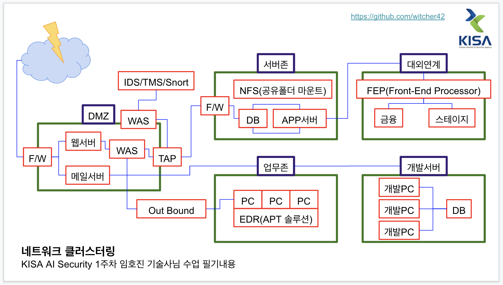

50명 중 5명만 받을수 있는 인증서때문인지  
협업이 전혀 안되고 있다  
모두가 개인플레이  

네트워크 쪽에서는 1도 출제되지 않았다👿   

수업중에 말도안되는 안드로이드 Activity 만드는 내용이 나오고   
중간중간 수업도중에 갑자기 가중치 설명나오고 k-means 설명이 나오길래  
뭐지 싶다가  
답답해서 시험에 나오는 거냐고 물어봤음ㅎㅎ  
나중에 보니 시험지에 뙇!!  
물론 틀렸음!!  

이번 시험은 마지막날 수업스킵하고 그시간에 시험공부한 사람이 승리자가 아닐까 생각  
어쩐지 컴(주말반과 같이쓰는 PC)에 언제부턴가 실습프로그램이 안깔려있고  
환경변수도 안잡혀 있었다  
물론 이정도 시험내용은 기본적으로 알고있어야 했다  
부족한 나를 탓하자  

같이 공부하는 사람들을 위해 문제를 찝어 보았는데 여기서 한문제도 안나왔다💩  

  
  
