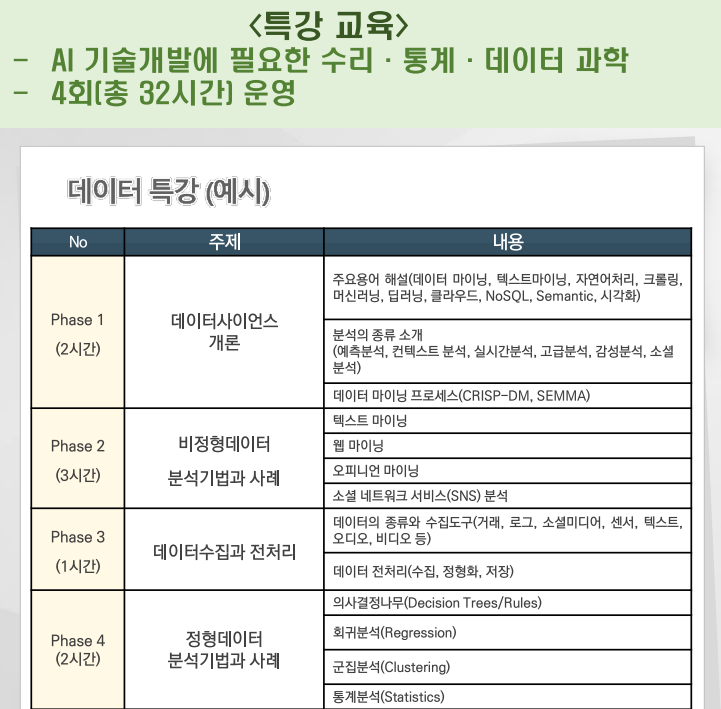

# 특강 1일차  
ETRI에서 임수종 책임연구원님이 오셨습니다  
짬에서 나오는 팁들을 많이 알려주셨습니다  
수업 중간중간 궁금한게 있어서 연구원님께  
Learning Rate항에 왜 /M이 있는지랑, Loss가 0으로 수렴하지 않았는데 왜 중간에 stop 하는데 여쭤봤는데  
이해가게 잘알려주셔서 좋았습니다👽  
특히나 신경망의 인덱스를 설명할때 원리를 알려주셔서 좋았고,  
시행착오 사례들도 많이 알려주셔서 챌린지때 적용할만한 인사이트를 얻을수 있었습니다..!  
1일차 끝!  

# 특강 2일차  
어제 강의하신 분이 제가 대학생때 인턴했었던 곳에서 오신분이라면  
오늘 수업은 제가 논문으로 상을 받았던!! 곳에서 일을하신 적이 있는 교수님께서 오셨습니다  
신기하기도 하고 대한민국이 참 좁다는 생각..?!  
그런데 대통령상 수상의 능력자 이동현 교수님의 명성과는 다르게  
수업은 좀처럼 흥미가 나지 않아서 자주 졸았습니다😵🤪  
세세한 부분도 많이 스킵하시고  
'여기서 이걸 왜 썼고 이것을(LSTM) 썼더니 어느부분에서 더 나은 결과 나왔다'  
이런 설명을 하신게 아니라서  
너무 입문자용 수업을 하신게 아닌가 하는 아쉬움이 남습니다  
(대학1학년 사회통계 느낌)  
  
# 특강 3일차  
IBM이라는 단어에서 무슨내용의 수업일지 대충 예상이 가서인지 많은분들이 나오지 않으셨다  
절반정도가 자체휴강했고, 본인도 런했다 다시 복귀한것    
오늘 수업에서도 빵구가 계속나왔다 
나눠주는 우유가 상한게 아닐까 하는 생각  
내일은 빵과 우유를 먹지말아봐야겠다  
(시원하게 길방구 끼면서 수영장 가는중 🏊)  
  
# 특강 4일차  
4일차는 에트리 연구원님께서 다시 오셔서 자연어처리 강의를 하셨다  
OT때 KSA에서 제공해주기로 약속한 특강교육과는 매우매우 많이 달랐다   
  
-----
"특강을 추천받는다, 여러분께 최대한 많이 제공해드리고싶다"고 해서  
다른 센터에서 제공하는 사이버보안 강의를 추천했더니 주말반에만 제공해주겠다고 한다  
2020 소마 "머신러닝을 이용한 사물인터넷 네트워크통신 이상트래픽 탐지" 팀을 섭외해달라고도 메일을 보냈는데,    
IoT쪽은 KISA 다른곳에서 한다고 여기서는 PC 보안만 하니까 안된다고 한다     
그럼 부트캠프에 IoTcube는 뭐지?  
또또또  
인강을 주는데 수강생 전부가 아닌, 메일을 보낸사람에게만 인강을 주겠다고 한다(이건 또 뭔소리지?)  
그래서 메일을 보냈는데 며칠째 답장이 없다  
이것도 fake야?    
실망감이 한트럭인데 차차 나아졌으면 좋겠다   

-----
삼성다니는 형하고 떡볶이를 먹으면서 이야기 해봤는데  
특강도 수업평가가 있으면 좋겠다고ㅋㅋㅋㅋ   
~~IBM특강과 챌린지~~  
~~자체휴강한 여러분이 👑Winner👑~~   
긍정적으로 생각하자 please!!
