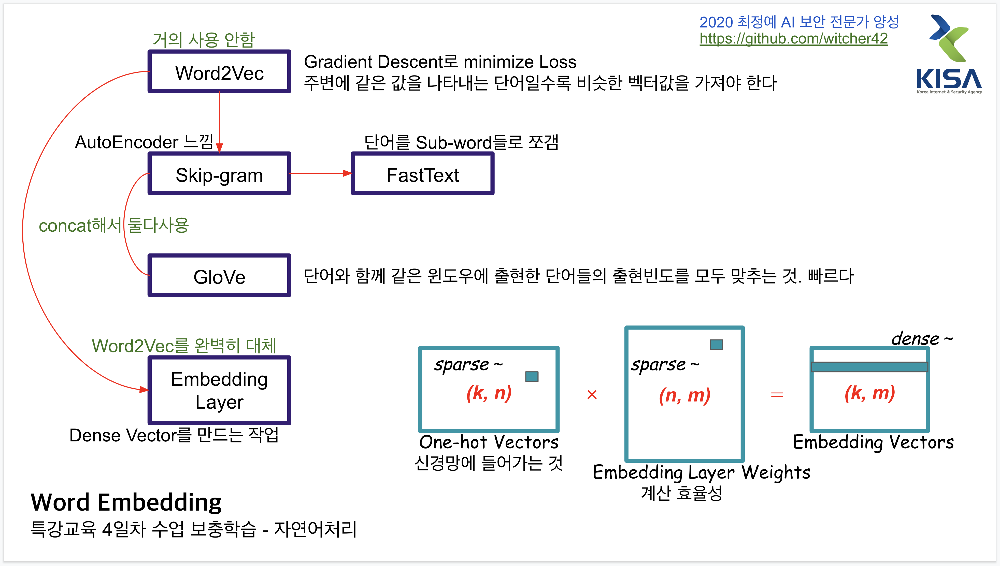

'소문난 명강의 김기현의 자연어 처리 딥러닝 캠프'를 참고한 셀프학습    
(아니 특강제공해주지도 않을거면서 왜 듣고싶은특강 말하라함? 🤥)  
  
  
### Feature Vector 
- 각 차원 dimension은 어떤 속성에 대한 level을 나타냄  
- 각 속성에 대한 level이 비슷할수록 비슷한 샘플이다  
- feature vector를 통해 샘플 사이의 거리를 계산할 수 있다  
### One-hot  
- Sparse vector
- Orthogonal, Cosine Similarity가 0이다
  - 유사도가 무의미해진다  
  - 두 샘플 사이의 거리를 나타내는 유사도를 구할수 없게 된다  
### Word Embedding
- 거리를 잘 반영하는 Dense vector로 임베딩  
- 또는 차원축소  
### AutoEncoder  
- 압축과 해제를 반복하며 특징추출을 자동으로 학습  
- 중간 결과물 z는 입력에 대한 feature vector이다  
  - One-hot vector의 embedding vector  
- MSE Loss를 최소하하는 방향으로 최적화 수행  

## 신경망이란? 입력공간(고차원공간, input space)에서 잠재공간(저차원공간, latent space)로의 매핑  
### NLU: 사람언어를 컴퓨터  
### NLG: 컴퓨터언어를 자연어로  
### 전통적 NLP
  - 단어를 Symbolic 데이터로 취급  
  - One-hot으로 나타내면 유사성이 사라짐  
### 딥러닝 NLP  
  - 단어를 Continuous value로 변환
  - but 미니배치를 어떻게 나누느냐, 처음 seed를 어떻게 잡느냐에 따라 학습이 매번 달라짐  
## 미니배치  
Sequence 차원의 크기는 미니배치 내의 가장 긴 문장에 의해 결정됨  
- 더 짧은 문장은 PAD 추가  
- 코퍼스의 각 문장을 길이순으로 정렬  
- 각 Token들을 사전을 활용하여 str --> index 매핑  
  - __Tokenization__ : 기존 띄어쓰기에 _을 넣고 새로운 띄어쓰기만 띄어줌  
  - __Detokenization__ : white space 제거 후 치환  
- 미니배치 크기대로 chunking  
- 미니배치별 텐서구성 및 padding  
- 학습시 미니배치를 shuffling하여 iterative하게 변환  
- but TorchText 하나면 끝  

