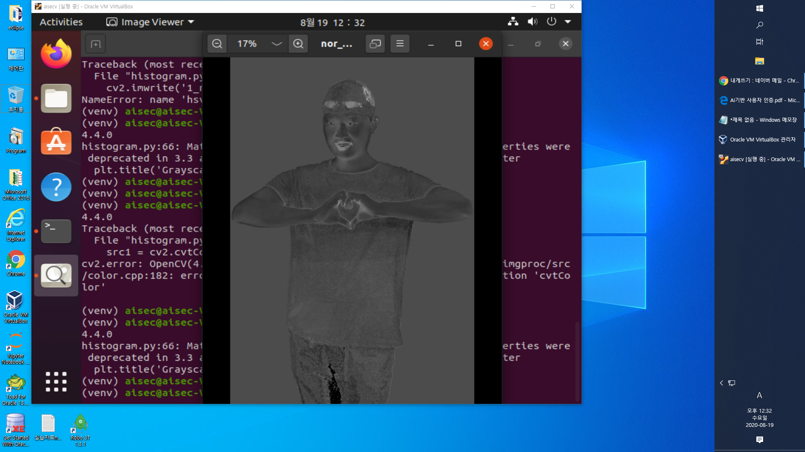
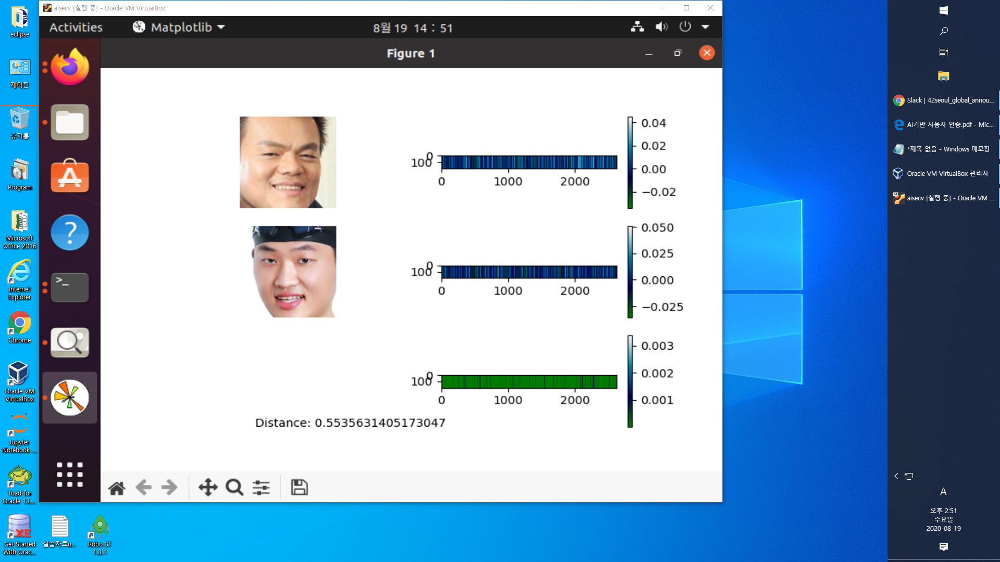
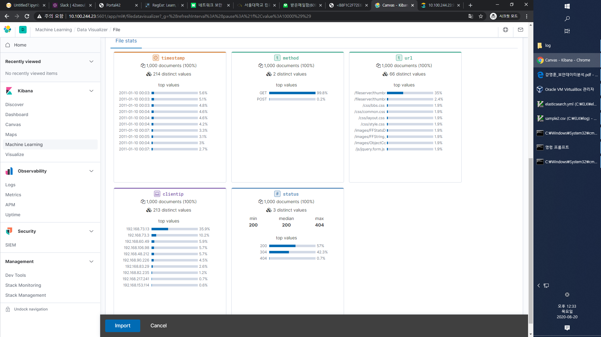
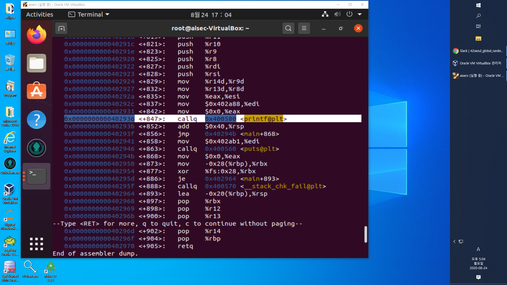
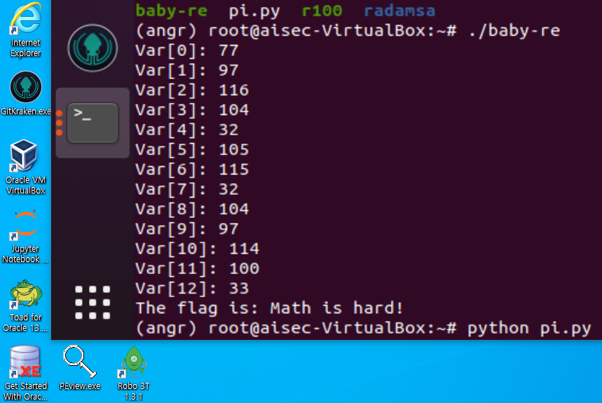

# 1·2일차    
전공 1·2일차 수업은 공주대학교 지능보안연구실 최대선 교수님께서 하셨습니다  
내년에 숭실대학교로 연구실을 옮긴다고 하시네요   
수업은 꿀잼 한트럭   
(조심하지않으면 넌 대학원생이 될거야 크큭...)  
삼성페이 해킹 시연이랑  
오토인코더 기반 Wifi 사용자인증을 알려주셨는데 완전 신기  
(Impact Factor 4 학술지에 실렸다고합니다 😮)  
식사를 안하신것 같아 카페에서 빵을 사서 드리려다가 말았습니다   
지난 기본과정때 강의하신분은 커피빈 치즈베이글을 드렸더니  
안드시고 그냥 버리시더라구요   
코로나라서 조심하는게 맞겠죠?   
어쨌든 2일차 수업 끝~  
아 재밌었다  
  
-----
  
-----
# 3일차   
호형호제하는 여동생님과 Kibana Internal Server Error의 늪에 빠져서 헤어나오질 못했습니다  
왜 잘되다가 안되는거야..시무룩..    
와 중앙대 사람들 에쿠스 타고다닌다 친해지고 싶다 🐸  
  
-----
# 4일차   
엠씨큐어 홍동철 대표님과 함께하는 
유명한 Defcon 2016 CTF 문제 baby-re 풀어버리기~  
  
-----
선형함수 각 항의 계수를 내보내는 RE 챌린지 파일이다  
일반적인 풀이법은 매우매우매우매우 복잡하다  
오늘 수업에서 배운 풀이법은 매우매우 직관적이면서도 빠르고 효율적이다(충격은 덤덤덤덤)   
정답 flag는..  
수학은 어렵다?!  
baby-re 문제가 방정식으로 이루어져 있어 맨손으로는 못풀기 때문!  
  
오늘은 공부도 좋았고 실습도 좋았고 좋은사람들도 더 알아가게 되어 좋았다 😸😽  
-----
# 5·6일차   
