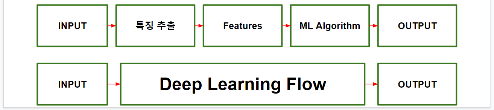

- 딥러닝이 잘 다루는 문제
  - 큰 분량의 데이터 확보가 가능한 문제
    - 상당한 노이즈가 있어도 데이터 분량이 크면 다룰 수 있음
  - 표지(label)가 있는 데이터
    - 현재 기술 수준에서는 아직까지는 supervised learning을 더 잘함
    - Label이 일반적인 분류문제의 label일 필요는 없음

- __머신러닝__  
  -     데이터 전처리 및 가공을 통해 문제 해결에 적합한 특징 추출 후 이를 학습 데이터로 패턴 분류기를 훈련
- __딥러닝__  
  -     특징 추출을 위한 전처리 단계를 (무감독학습) 전체 학습 프로세스에 포함시켜 자동으로 학습함  
-----
 
- __활성화 함수 (Activation function)__  
  - 경계면의 부근의 모양을 결정  
  - s = w·x   
    - 시그모이드 함수 (sigmoid function)  
    - 하이퍼볼릭 탄젠트 함수 (tanh function) 
    - ReLU (Rectified Linear function)  
- 다층 뉴런의 필요성   
  - 복잡한 패턴 분류를 위해서는 입출력 간의 복잡한 변환 구조가 필요  
  - 단일 뉴런으로는 선형분리가 가능한 결정 경계선만을 생성 가능  
  - 각 층 안에서는 뉴런간 연결이 없으며 인접한 두 층의 뉴런 간에는 완전 연결됨  
    - 입력층 비례조정함수   
    - 은닉층 활성함수   
    - 출력층 활성함수  
- __전방향 추론(Forward	Chaining)__  
  - 데이터 --> 규칙  
  - 상향식 추론(bottom-up)  
  - 데이터기반 추론  
  - 결과 예측  
  - 비효율적일 수도 있으나 새로운 결과 발견 가능성 있음  
- __역방향 추론(Backward	Chaining)__     
  - 규칙 --> 데이터  
  - 하향식 추론(top-down)  
  - 가설기반 추론  
  - 원인 진단  
  - 추론이 효율적이나 새로운 결과 발견 가능성 적음  
- MLP 시대의 한계  
  - 2 계층을 넘는 MLP는 잘 학습되지 않음  
  - Overfitting, Local optima가 많은 탐색공간  
  - 매우 느리고 고차원 데이터 처리가 잘 되지 않음  
    - __Vanishing gradient 문제임이 알려짐 --> ReLU 사용__  
# ReLU  
정류선형유닛 Rectified Linear Unit  
- 미분시 경사도가 0이 아닌 상수가 된다   
- __오차희석을 방지한다__    
- 포화가 되지 않는(non-saturating) 비선형 구조(시그모이드는 포화되는(saturating) 비선형 구조)  

Regularization 
- Problem  
  - over-fitting  
- Solution  
  - Data augmentation  
    - train it on more data  
  - Determining #hidden units
  - Weight decay
  - Early stopping
  - Dropout
  - Batch normalization

# TF  
Variable의 값을 확인하고 싶을 때  
-     variable.eval(), w.eval()    
초기화한 변수 값 변경 & 초기화 기능
-     tf.assign(W, [-1.])    
주어진 axis를 따라 Input 중 가장 큰 value의 index를 return  
-     tf.argmax(input, axis=None)    
x와 y를 element-wise로 비교하여 해당 위치에 같으면 1, 다르면 0이 할당  
-     tf.equal(x, y)    
tensor를 반환해주는 operation, 주어진 tensor를 주어진 dtype으로 변환시켜 return   
-     tf.cast(x, dtype)      
  
